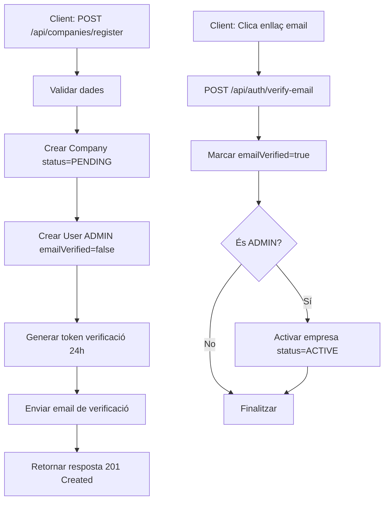

# 📚 Abasta Back-End API REST

API REST desenvolupada amb Spring Boot per a la gestió d'empreses i usuaris amb autenticació JWT.

## 📋 Descripció

Abasta Back-End és una API REST que proporciona un sistema complet de registre i gestió d'empreses amb els seus administradors i usuaris. Inclou funcionalitats d'autenticació, verificació d'email i recuperació de contrasenya.

**Versió:** 1.0  
**Framework:** Spring Boot 3.5.6  
**Llenguatge:** Java 21  
**Base de dades:** MySQL  
**Autenticació:** JWT (JSON Web Tokens)

## ✨ Característiques Principals

- ✅ **Registre Multi-entitat**: Registre d'empresa i administrador en una sola petició
- ✅ **Sistema de Verificació d'Email**: Tokens amb caducitat de 24 hores
- ✅ **Autenticació JWT Segura**: Tokens amb caducitat d'1 hora i algoritme HS512
- ✅ **Recuperació de Contrasenya**: Sistema complet amb tokens d'1 hora
- ✅ **Gestió d'Errors Centralitzada**: Respostes uniformes i missatges en català
- ✅ **Validacions Robustes**: Bean Validation amb requisits de contrasenya complexa
- ✅ **Sistema d'Emails**: Integració amb SMTP per notificacions

## 🛠 Stack Tecnològic

- **Backend**: Spring Boot 3.5.6, Java 21
- **Seguretat**: Spring Security, JWT (HS512)
- **Base de dades**: MySQL, Spring Data JPA, Hibernate
- **Validació**: Bean Validation (Jakarta Validation)
- **Email**: Spring Mail (SMTP)
- **Documentació API**: Springdoc OpenAPI (Swagger)
- **Utilitats**: Lombok, BCrypt

## 📦 Prerequisits

- Java 21 o superior
- Maven 3.8+
- MySQL 8.0+
- Un compte de correu SMTP (Gmail)

## 🚀 Instal·lació i Configuració

### 1. Clonar el repositori
```bash
git clone https://github.com/abastaplatform/abasta.git
cd abasta
```

### 2. Crear la base de dades
```sql
CREATE DATABASE abasta_db CHARACTER SET utf8mb4 COLLATE utf8mb4_unicode_ci;
```

### 3. Executar els scripts SQL

<details>
<summary>Script de creació de taules</summary>

```sql
CREATE TABLE companies (
    id BIGINT PRIMARY KEY AUTO_INCREMENT,
    uuid VARCHAR(255) NOT NULL UNIQUE,
    name VARCHAR(255) NOT NULL,
    tax_id VARCHAR(50) UNIQUE NOT NULL COMMENT 'NIF/CIF',
    email VARCHAR(255),
    phone VARCHAR(50),
    address TEXT,
    city VARCHAR(100),
    postal_code VARCHAR(20),
    status ENUM('ACTIVE', 'INACTIVE', 'PENDING') DEFAULT 'PENDING',
    created_at TIMESTAMP DEFAULT CURRENT_TIMESTAMP,
    updated_at TIMESTAMP DEFAULT CURRENT_TIMESTAMP ON UPDATE CURRENT_TIMESTAMP,
    INDEX idx_status (status),
    INDEX idx_created_at (created_at)
) ENGINE=InnoDB DEFAULT CHARSET=utf8mb4 COLLATE=utf8mb4_unicode_ci;

CREATE TABLE users (
id BIGINT PRIMARY KEY AUTO_INCREMENT,
uuid VARCHAR(255) NOT NULL UNIQUE,
company_id BIGINT NOT NULL,
email VARCHAR(255) UNIQUE NOT NULL,
password VARCHAR(255) NOT NULL COMMENT 'BCrypt hash',
first_name VARCHAR(100) NOT NULL,
last_name VARCHAR(100) NOT NULL,
role ENUM('ADMIN', 'USER') DEFAULT 'USER',
phone VARCHAR(50),
is_active BOOLEAN DEFAULT TRUE,
email_verified BOOLEAN DEFAULT FALSE,
email_verification_token VARCHAR(255),
email_verification_expires TIMESTAMP NULL,
password_reset_token VARCHAR(255),
password_reset_expires TIMESTAMP NULL,
last_login TIMESTAMP NULL,
created_at TIMESTAMP DEFAULT CURRENT_TIMESTAMP,
updated_at TIMESTAMP DEFAULT CURRENT_TIMESTAMP ON UPDATE CURRENT_TIMESTAMP,
FOREIGN KEY (company_id) REFERENCES companies(id),
INDEX idx_company_id (company_id),
INDEX idx_email (email),
INDEX idx_role (role),
INDEX idx_email_verification_token (email_verification_token),
INDEX idx_password_reset_token (password_reset_token)
) ENGINE=InnoDB DEFAULT CHARSET=utf8mb4 COLLATE=utf8mb4_unicode_ci;
```

</details>

### 4. Configurar les variables d'entorn

Crea un fitxer `.env` o configura les variables d'entorn:
```bash
# Base de dades
DB_USER_ABASTA=el_teu_usuari_mysql
DB_PASS_ABASTA=la_teva_contrasenya_mysql

# Email (Gmail)
MAIL_USER_ABASTA=el_teu_email@gmail.com
MAIL_PASS_ABASTA=la_teva_app_password_gmail
```

> ⚠️ **Nota sobre Gmail**: Cal generar una "App Password" des de la configuració de seguretat del compte de Google.

### 5. Compilar i executar
```bash
mvn clean install
mvn spring-boot:run
```

L'aplicació estarà disponible a: `https://deveps.ddns.net/abasta/api/*`

## 📁 Estructura del Projecte
```
abasta-back-end/
├── src/main/java/cat/abasta_back_end/
│   ├── config/           # Configuracions (Swagger)
│   ├── controllers/      # Controladors REST
│   │   ├── AuthController
│   │   └── CompanyController
│   ├── dto/             # Data Transfer Objects
│   ├── entities/        # Entitats JPA (Company, User)
│   ├── exceptions/      # Gestió d'errors personalitzada
│   ├── repositories/    # Repositoris JPA
│   ├── security/        # JWT i configuració de seguretat CORS
│   └── services/        # Lògica de negoci
│       └── impl/        # Implementacions dels serveis
└── src/main/resources/
    └── application.properties
```

## 🔌 API Endpoints

### 🔐 Autenticació (5 endpoints)

| Mètode | Endpoint | Descripció | Auth |
|--------|----------|------------|------|
| `POST` | `/api/auth/login` | Login d'usuari | Públic |
| `POST` | `/api/auth/verify-email` | Verificar email | Públic |
| `POST` | `/api/auth/forgot-password` | Sol·licitar recuperació de contrasenya | Públic |
| `POST` | `/api/auth/reset-password` | Restablir contrasenya | Públic |
| `POST` | `/api/auth/resend-verification` | Reenviar email de verificació | Públic |

### 🏢 Empreses (1 endpoint)

| Mètode | Endpoint | Descripció | Auth |
|--------|----------|------------|------|
| `POST` | `/api/companies/register` | Registrar empresa + administrador | Públic |

### 📖 Documentació Swagger

Accedeix a la documentació interactiva de l'API:
```
https://deveps.ddns.net/abasta/swagger-ui.html
```

## 💾 Base de Dades

### Taules

#### `companies`
Emmagatzema la informació de les empreses clients.

**Camps principals:**
- `id`: Identificador intern
- `uuid`: Identificador únic per ús extern
- `name`: Nom de l'empresa
- `tax_id`: NIF/CIF (únic)
- `email`: Email de contacte
- `status`: PENDING | ACTIVE | INACTIVE

#### `users`
Emmagatzema els usuaris de cada empresa.

**Camps principals:**
- `id`: Identificador intern
- `uuid`: Identificador únic per ús extern
- `company_id`: Referència a l'empresa
- `email`: Email de l'usuari (únic)
- `role`: ADMIN | USER
- `email_verified`: Estat de verificació
- `password`: Contrasenya encriptada amb BCrypt

### Relacions

- Una empresa (`Company`) pot tenir múltiples usuaris (`User`)
- Cada usuari pertany a una única empresa

## 🔒 Seguretat

### JWT (JSON Web Tokens)

- **Algoritme**: HS512 (HMAC-SHA512)
- **Expiració**: 1 hora
- **Claims inclosos**:
    - `sub`: Email de l'usuari
    - `role`: Rol (ADMIN/USER)
    - `uuid`: UUID de l'usuari
    - `companyId`: ID de l'empresa

### Contrasenya

Requisits de validació:
- Mínim 8 caràcters
- Almenys 1 lletra majúscula
- Almenys 1 lletra minúscula
- Almenys 1 número
- Almenys 1 caràcter especial (@#$%^&+=...)

**Exemples vàlids:**
- `Password123@`
- `Abcd1234#`

## 📧 Sistema d'Emails

### Tipus d'emails

1. **Email de verificació** (caducitat: 24h)
    - S'envia després del registre
    - Conté l'enllaç de verificació amb token

2. **Email de recuperació de contrasenya** (caducitat: 1h)
    - S'envia quan l'usuari sol·licita recuperar la contrasenya
    - Conté l'enllaç per restablir-la

## 🔄 Flux Principal de Registre


## 🧪 Exemples d'Ús

### Registrar una empresa
```bash
curl -X POST https://deveps.ddns.net/abasta/api/companies/register \
  -H "Content-Type: application/json" \
  -d '{
    "companyName": "Empresa SL",
    "taxId": "B12345678",
    "companyEmail": "info@empresa.cat",
    "adminEmail": "admin@empresa.cat",
    "adminPassword": "Password123@",
    "adminFirstName": "Joan",
    "adminLastName": "Garcia"
  }'
```

### Login
```bash
curl -X POST https://deveps.ddns.net/abasta/api/auth/login \
  -H "Content-Type: application/json" \
  -d '{
    "email": "admin@empresa.cat",
    "password": "Password123@"
  }'
```

### Verificar email
```bash
curl -X POST https://deveps.ddns.net/abasta/api/auth/verify-email \
  -H "Content-Type: application/json" \
  -d '{
    "token": "550e8400-e29b-41d4-a716-446655440000"
  }'
```

## 📝 Format de Resposta

Totes les respostes segueixen el format `ApiResponseDTO`:
```json
{
  "success": true,
  "message": "Operació realitzada correctament",
  "data": { ... },
  "timestamp": "2025-10-26T14:30:00"
}
```

## ⚠️ Gestió d'Errors

### Codis HTTP

| Codi | Descripció |
|------|------------|
| `200` | Operació correcta |
| `201` | Recurs creat correctament |
| `400` | Petició incorrecta o validació fallida |
| `401` | No autoritzat (token invàlid o expirat) |
| `404` | Recurs no trobat |
| `409` | Conflicte (recurs duplicat) |
| `500` | Error intern del servidor |

### Exemple d'error de validació
```json
{
  "success": false,
  "message": "Errors de validació",
  "data": {
    "email": "Format d'email invàlid",
    "password": "La contrasenya ha de contenir majúscula, minúscula, número i caràcter especial"
  },
  "timestamp": "2025-10-26T14:30:00"
}
```

## 🤝 Contribucions

Les contribucions són benvingudes! Si vols col·laborar:

1. Fes un fork del projecte
2. Crea una branca per a la teva funcionalitat (`git checkout -b feature/nova-funcionalitat`)
3. Fes commit dels teus canvis (`git commit -m 'Afegir nova funcionalitat'`)
4. Puja la branca (`git push origin feature/nova-funcionalitat`)
5. Obre un Pull Request

## 📄 Llicència

Aquest projecte està sota llicència [MIT](LICENSE).

## 👥 Autors

- **Equip Abasta** - *Desenvolupament inicial*

## 📞 Contacte

Per a qualsevol consulta o suggeriment, obre un issue al repositori.

---

**Documentació completa**: Consulta el PDF de documentació tècnica per a més detalls sobre l'arquitectura i implementació.
