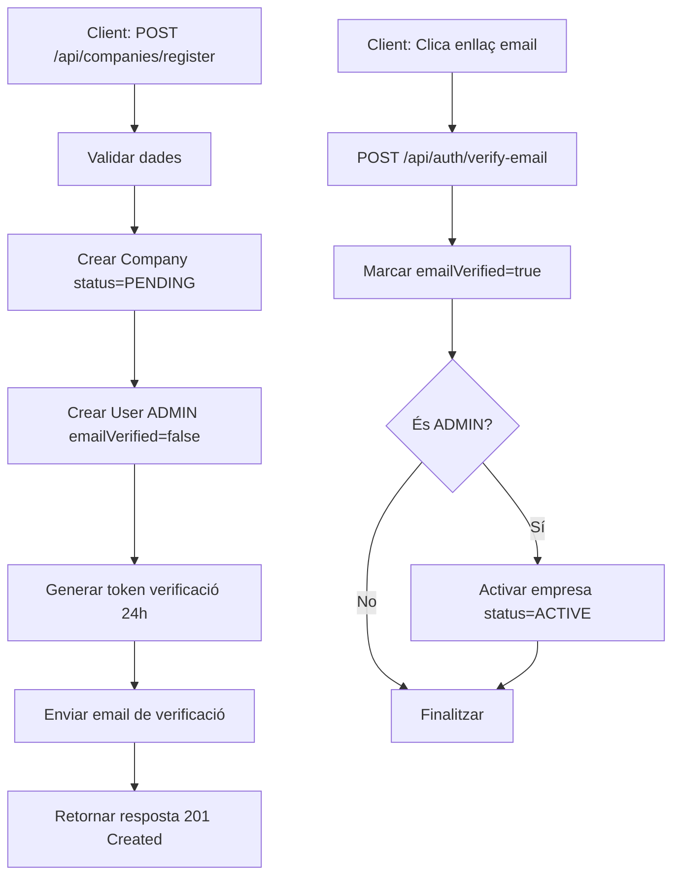
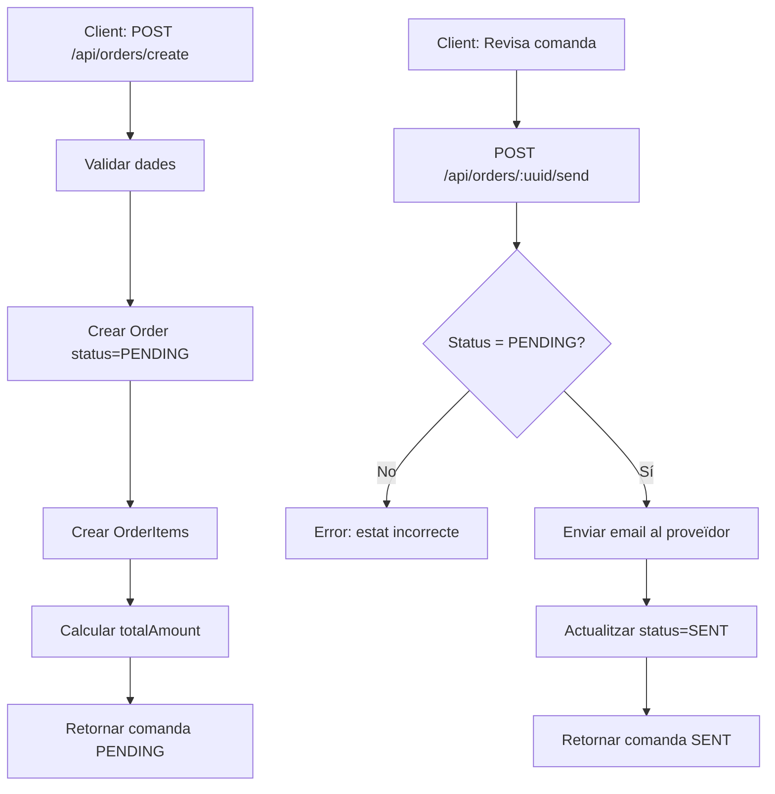

# 📚 Abasta Back-End API REST

API REST desenvolupada amb Spring Boot per a la gestió integral de la cadena de subministrament B2B per a pimes.

## 📋 Descripció

Abasta Back-End és una API REST que proporciona una plataforma completa per a pimes que vulguin gestionar els seus proveïdors, mantenir un catàleg de productes i enviar comandes de manera eficient. Inclou funcionalitats de gestió d'empreses, proveïdors, productes amb catàleg visual, sistema de comandes amb notificacions per email, autenticació JWT, verificació d'email i recuperació de contrasenya.

**Versió:** 1.2  
**Framework:** Spring Boot 3.5.6
**Llenguatge:** Java 21  
**Base de dades:** MySQL  
**Autenticació:** JWT (JSON Web Tokens)

## ✨ Característiques Principals

- ✅ **Gestió Multi-entitat**: Empreses, usuaris, proveïdors i productes
- ✅ **Catàleg de Productes**: Gestió completa amb imatges i cerca avançada
- ✅ **Sistema de Comandes**: Creació i enviament amb notificacions per email
- ✅ **Sistema de Verificació d'Email**: Tokens amb caducitat de 24 hores
- ✅ **Autenticació JWT Segura**: Tokens amb caducitat d'1 hora i algoritme HS512
- ✅ **Recuperació de Contrasenya**: Sistema complet amb tokens d'1 hora
- ✅ **Cerca Avançada**: Filtres múltiples amb paginació i ordenació
- ✅ **Gestió d'Errors Centralitzada**: Respostes uniformes i missatges en català
- ✅ **Validacions Robustes**: Bean Validation amb requisits de contrasenya complexa
- ✅ **Sistema d'Emails**: Integració amb SMTP per notificacions i comandes

## 🛠 Stack Tecnològic

- **Backend**: Spring Boot 3.5.6, Java 21
- **Seguretat**: Spring Security, JWT (HS512)
- **Base de dades**: MySQL, Spring Data JPA, Hibernate
- **Validació**: Bean Validation (Jakarta Validation)
- **Email**: Spring Mail (SMTP)
- **Documentació API**: Springdoc OpenAPI (Swagger)
- **Utilitats**: Lombok, BCrypt

## 📦 Prerequisits

- Java 21 o superior
- Maven 3.8+
- MySQL 8.0+
- Un compte de correu SMTP (Gmail)

## 🚀 Instal·lació i Configuració

### 1. Clonar el repositori

```bash
git clone https://github.com/abastaplatform/abasta.git
cd abasta
```

### 2. Crear la base de dades

```sql
CREATE DATABASE abasta_db CHARACTER SET utf8mb4 COLLATE utf8mb4_unicode_ci;
```

### 3. Executar els scripts SQL

```sql
-- Taula companies
CREATE TABLE companies (
    id BIGINT PRIMARY KEY AUTO_INCREMENT,
    uuid VARCHAR(255) NOT NULL UNIQUE,
    name VARCHAR(255) NOT NULL,
    tax_id VARCHAR(50) UNIQUE NOT NULL COMMENT 'NIF/CIF',
    email VARCHAR(255),
    phone VARCHAR(50),
    address TEXT,
    city VARCHAR(100),
    postal_code VARCHAR(20),
    status ENUM('ACTIVE', 'INACTIVE', 'PENDING') DEFAULT 'PENDING',
    created_at TIMESTAMP DEFAULT CURRENT_TIMESTAMP,
    updated_at TIMESTAMP DEFAULT CURRENT_TIMESTAMP ON UPDATE CURRENT_TIMESTAMP,
    INDEX idx_status (status),
    INDEX idx_created_at (created_at)
) ENGINE=InnoDB DEFAULT CHARSET=utf8mb4 COLLATE=utf8mb4_unicode_ci;

-- Taula users
CREATE TABLE users (
    id BIGINT PRIMARY KEY AUTO_INCREMENT,
    uuid VARCHAR(255) NOT NULL UNIQUE,
    company_id BIGINT NOT NULL,
    email VARCHAR(255) UNIQUE NOT NULL,
    password VARCHAR(255) NOT NULL COMMENT 'BCrypt hash',
    first_name VARCHAR(100) NOT NULL,
    last_name VARCHAR(100) NOT NULL,
    role ENUM('ADMIN', 'USER') DEFAULT 'USER',
    phone VARCHAR(50),
    is_active BOOLEAN DEFAULT TRUE,
    email_verified BOOLEAN DEFAULT FALSE,
    email_verification_token VARCHAR(255),
    email_verification_expires TIMESTAMP NULL,
    password_reset_token VARCHAR(255),
    password_reset_expires TIMESTAMP NULL,
    last_login TIMESTAMP NULL,
    created_at TIMESTAMP DEFAULT CURRENT_TIMESTAMP,
    updated_at TIMESTAMP DEFAULT CURRENT_TIMESTAMP ON UPDATE CURRENT_TIMESTAMP,
    FOREIGN KEY (company_id) REFERENCES companies(id),
    INDEX idx_company_id (company_id),
    INDEX idx_email (email),
    INDEX idx_role (role),
    INDEX idx_email_verification_token (email_verification_token),
    INDEX idx_password_reset_token (password_reset_token)
) ENGINE=InnoDB DEFAULT CHARSET=utf8mb4 COLLATE=utf8mb4_unicode_ci;

-- Taula suppliers
CREATE TABLE suppliers (
    id BIGINT PRIMARY KEY AUTO_INCREMENT,
    uuid VARCHAR(255) NOT NULL UNIQUE,
    company_id BIGINT NOT NULL,
    name VARCHAR(255) NOT NULL,
    contact_name VARCHAR(255),
    email VARCHAR(255),
    phone VARCHAR(50),
    address TEXT,
    notes TEXT,
    is_active BOOLEAN DEFAULT TRUE,
    created_at TIMESTAMP DEFAULT CURRENT_TIMESTAMP,
    updated_at TIMESTAMP DEFAULT CURRENT_TIMESTAMP ON UPDATE CURRENT_TIMESTAMP,
    FOREIGN KEY (company_id) REFERENCES companies(id),
    INDEX idx_company_id (company_id),
    INDEX idx_name (name),
    INDEX idx_is_active (is_active)
) ENGINE=InnoDB DEFAULT CHARSET=utf8mb4 COLLATE=utf8mb4_unicode_ci;

-- Taula products
CREATE TABLE products (
    id BIGINT PRIMARY KEY AUTO_INCREMENT,
    uuid VARCHAR(255) NOT NULL UNIQUE,
    supplier_id BIGINT NOT NULL,
    category VARCHAR(255),
    name VARCHAR(255) NOT NULL,
    description TEXT,
    price DECIMAL(10,2) NOT NULL,
    volume DECIMAL(10,2),
    unit VARCHAR(50),
    image_url VARCHAR(500),
    is_active BOOLEAN DEFAULT TRUE,
    created_at TIMESTAMP DEFAULT CURRENT_TIMESTAMP,
    updated_at TIMESTAMP DEFAULT CURRENT_TIMESTAMP ON UPDATE CURRENT_TIMESTAMP,
    FOREIGN KEY (supplier_id) REFERENCES suppliers(id),
    INDEX idx_supplier_id (supplier_id),
    INDEX idx_category (category),
    INDEX idx_is_active (is_active)
) ENGINE=InnoDB DEFAULT CHARSET=utf8mb4 COLLATE=utf8mb4_unicode_ci;

-- Taula orders
CREATE TABLE orders (
    id BIGINT PRIMARY KEY AUTO_INCREMENT,
    uuid VARCHAR(255) NOT NULL UNIQUE,
    company_id BIGINT NOT NULL,
    user_id BIGINT NOT NULL,
    supplier_id BIGINT NOT NULL,
    name VARCHAR(255) NOT NULL,
    status ENUM('PENDING', 'SENT', 'CONFIRMED', 'REJECTED', 'COMPLETED', 'CANCELLED') DEFAULT 'PENDING',
    total_amount DECIMAL(10,2) NOT NULL,
    notes TEXT,
    delivery_date DATE,
    created_at TIMESTAMP DEFAULT CURRENT_TIMESTAMP,
    updated_at TIMESTAMP DEFAULT CURRENT_TIMESTAMP ON UPDATE CURRENT_TIMESTAMP,
    FOREIGN KEY (company_id) REFERENCES companies(id),
    FOREIGN KEY (user_id) REFERENCES users(id),
    FOREIGN KEY (supplier_id) REFERENCES suppliers(id),
    INDEX idx_company_id (company_id),
    INDEX idx_user_id (user_id),
    INDEX idx_supplier_id (supplier_id),
    INDEX idx_status (status)
) ENGINE=InnoDB DEFAULT CHARSET=utf8mb4 COLLATE=utf8mb4_unicode_ci;

-- Taula order_items
CREATE TABLE order_items (
    id BIGINT PRIMARY KEY AUTO_INCREMENT,
    uuid VARCHAR(255) NOT NULL UNIQUE,
    order_id BIGINT NOT NULL,
    product_id BIGINT NOT NULL,
    quantity DECIMAL(10,2) NOT NULL,
    unit_price DECIMAL(10,2) NOT NULL,
    subtotal DECIMAL(10,2) NOT NULL,
    notes TEXT,
    created_at TIMESTAMP DEFAULT CURRENT_TIMESTAMP,
    FOREIGN KEY (order_id) REFERENCES orders(id),
    FOREIGN KEY (product_id) REFERENCES products(id),
    INDEX idx_order_id (order_id),
    INDEX idx_product_id (product_id)
) ENGINE=InnoDB DEFAULT CHARSET=utf8mb4 COLLATE=utf8mb4_unicode_ci;
```

### 4. Configurar les variables d'entorn

Crea un fitxer `.env` o configura les variables d'entorn:

```bash
# Base de dades
DB_USER_ABASTA=el_teu_usuari_mysql
DB_PASS_ABASTA=la_teva_contrasenya_mysql

# Email (Gmail)
MAIL_USER_ABASTA=el_teu_email@gmail.com
MAIL_PASS_ABASTA=la_teva_app_password_gmail
```

> ⚠️ **Nota sobre Gmail**: Cal generar una "App Password" des de la configuració de seguretat del compte de Google.

### 5. Compilar i executar

```bash
mvn clean install
mvn spring-boot:run
```

L'aplicació estarà disponible a: `https://deveps.ddns.net/abasta/api/*`

## 📁 Estructura del Projecte

```Esquema
abasta-back-end/
├── src/main/java/cat/abasta_back_end/
│   ├── config/           # Configuracions (Swagger, web)
│   ├── controllers/      # Controladors REST
│   │   ├── AuthController
│   │   ├── CompanyController
│   │   ├── SupplierController
│   │   ├── ProductController
│   │   └── OrderController
│   ├── dto/             # Data Transfer Objects
│   ├── entities/        # Entitats JPA
│   ├── exceptions/      # Gestió d'errors personalitzada
│   ├── repositories/    # Repositoris JPA
│   ├── security/        # JWT i configuració de seguretat
│   └── services/        # Lògica de negoci
│       └── impl/        # Implementacions dels serveis
└── src/main/resources/
    ├── application.properties
    └── img/productes/   # Directori d'imatges de productes
```

## 🔌 API Endpoints

### 🔐 Autenticació (5 endpoints)

| Mètode | Endpoint | Descripció | Auth |
|--------|----------|------------|------|
| `POST` | `/api/auth/login` | Login d'usuari | Públic |
| `POST` | `/api/auth/verify-email` | Verificar email | Públic |
| `POST` | `/api/auth/forgot-password` | Sol·licitar recuperació de contrasenya | Públic |
| `POST` | `/api/auth/reset-password` | Restablir contrasenya | Públic |
| `POST` | `/api/auth/resend-verification` | Reenviar email de verificació | Públic |

### 🏢 Empreses (3 endpoints)

| Mètode | Endpoint | Descripció | Auth |
|--------|----------|------------|------|
| `POST` | `/api/companies/register` | Registrar empresa + administrador | Públic |
| `GET` | `/api/companies` | Obtenir dades de l'empresa | JWT |
| `PUT` | `/api/companies` | Actualitzar dades de l'empresa | JWT |

**Exemple de registre:**

```json
POST /api/companies/register
{
  "companyName": "Ferreteria El Martell SL",
  "taxId": "B12345678",
  "companyEmail": "info@elmartell.cat",
  "companyPhone": "932123456",
  "companyAddress": "Carrer Major 123, Barcelona",
  "adminEmail": "admin@elmartell.cat",
  "adminPassword": "Password123@",
  "adminFirstName": "Joan",
  "adminLastName": "Garcia"
}
```

### 🚚 Proveïdors (7 endpoints)

| Mètode | Endpoint | Descripció | Auth |
|--------|----------|------------|------|
| `GET` | `/api/suppliers` | Llistar tots els proveïdors de l'empresa | JWT |
| `GET` | `/api/suppliers/{uuid}` | Obtenir proveïdor per UUID | JWT |
| `POST` | `/api/suppliers` | Crear nou proveïdor | JWT |
| `PUT` | `/api/suppliers/{uuid}` | Actualitzar proveïdor | JWT |
| `PATCH` | `/api/suppliers/{uuid}/status` | Activar/desactivar proveïdor | JWT |
| `GET` | `/api/suppliers/search` | Cerca bàsica per text | JWT |
| `GET` | `/api/suppliers/filter` | Cerca avançada amb filtres | JWT |

**Paràmetres de paginació (tots els endpoints GET):**

- `page`: número de pàgina (default: 0)
- `size`: elements per pàgina (default: 10)
- `sortBy`: camp d'ordenació (default: "name")
- `sortDir`: direcció "asc" o "desc" (default: "asc")

**Exemple de creació:**

```json
POST /api/suppliers
{
  "name": "Proveïdors Catalunya SL",
  "contactName": "Pere Martínez",
  "email": "pere@provcat.com",
  "phone": "938765432",
  "address": "Av. Diagonal 123, Barcelona",
  "notes": "Proveïdor de materials de construcció",
  "isActive": true
}
```

**Exemple de cerca bàsica:**

```bash
GET /api/suppliers/search?searchText=Barcelona&page=0&size=10
```

**Exemple de cerca avançada:**

```bash
GET /api/suppliers/filter?name=Catalunya&email=@provcat.com&phone=93&page=0&size=10
```

### 📦 Productes (9 endpoints)

| Mètode | Endpoint | Descripció | Auth |
|--------|----------|------------|------|
| `GET` | `/api/products` | Llistar tots els productes de l'empresa | JWT |
| `GET` | `/api/products/{uuid}` | Obtenir producte per UUID | JWT |
| `POST` | `/api/products/create` | Crear nou producte | JWT |
| `PUT` | `/api/products/{uuid}` | Actualitzar producte | JWT |
| `PATCH` | `/api/products/deactivate/{uuid}` | Desactivar producte | JWT |
| `GET` | `/api/products/search` | Cerca per proveïdor o empresa | JWT |
| `GET` | `/api/products/filter` | Cerca avançada amb filtres | JWT |
| `POST` | `/api/products/upload/{productUuid}` | Pujar imatge a producte existent | JWT |
| `POST` | `/api/products/upload-temp` | Pujar imatge temporal | JWT |

**Filtres disponibles en cerca avançada:**

- `supplierUuid`: filtrar per proveïdor específic
- `name`: nom del producte (cerca parcial)
- `description`: descripció (cerca parcial)
- `category`: categoria (cerca parcial)
- `volume`: volum exacte
- `unit`: unitat de mesura
- `minPrice` / `maxPrice`: rang de preus
- `isActive`: estat actiu/inactiu

**Exemple de creació:**

```json
POST /api/products/create
{
  "supplierUuid": "550e8400-e29b-41d4-a716-446655440000",
  "category": "Begudes",
  "name": "Aigua mineral 1L",
  "description": "Ampolla d'aigua natural sense gas",
  "price": 0.80,
  "volume": 1.0,
  "unit": "litre",
  "imageUrl": "/img/productes/aigua1l.png"
}
```

**Exemple de cerca:**

```bash
GET /api/products/search?supplierUuid=550e8400-e29b-41d4-a716-446655440000&searchText=aigua
```

**Exemple de filtre avançat:**

```bash
GET /api/products/filter?category=Begudes&minPrice=0.50&maxPrice=2.00&isActive=true
```

**Pujada d'imatges:**

```bash
# Imatge per producte existent
POST /api/products/upload/{productUuid}
Content-Type: multipart/form-data
Body: image=[file]

# Imatge temporal (abans de crear producte)
POST /api/products/upload-temp
Content-Type: multipart/form-data
Body: image=[file]
```

### 🛒 Comandes (2 endpoints)

| Mètode | Endpoint | Descripció | Auth |
|--------|----------|------------|------|
| `POST` | `/api/orders/create` | Crear nova comanda (estat PENDING) | JWT |
| `POST` | `/api/orders/{uuid}/send` | Enviar comanda al proveïdor (estat SENT) | JWT |

**Estats de les comandes:**

- `PENDING`: Comanda creada però no enviada
- `SENT`: Comanda enviada al proveïdor per email
- `CONFIRMED`: Confirmada pel proveïdor
- `REJECTED`: Rebutjada
- `COMPLETED`: Completada
- `CANCELLED`: Cancel·lada

**Exemple de creació:**

```json
POST /api/orders/create
{
  "name": "Comanda Setmanal #123",
  "supplierUuid": "550e8400-e29b-41d4-a716-446655440000",
  "deliveryDate": "2025-11-25",
  "notes": "Entregar abans de les 10h",
  "items": [
    {
      "productUuid": "660e8400-e29b-41d4-a716-446655440001",
      "quantity": 10,
      "notes": "Preferiblement ecològica"
    },
    {
      "productUuid": "770e8400-e29b-41d4-a716-446655440002",
      "quantity": 5,
      "notes": null
    }
  ]
}
```

**Resposta:**

```json
{
  "success": true,
  "message": "Comanda creada correctament",
  "data": {
    "uuid": "880e8400-e29b-41d4-a716-446655440000",
    "name": "Comanda Setmanal #123",
    "status": "PENDING",
    "totalAmount": 25.50,
    "supplierUuid": "550e8400-e29b-41d4-a716-446655440000",
    "deliveryDate": "2025-11-25",
    "notes": "Entregar abans de les 10h",
    "items": [
      {
        "uuid": "990e8400-e29b-41d4-a716-446655440000",
        "productUuid": "660e8400-e29b-41d4-a716-446655440001",
        "productName": "Aigua mineral 1L",
        "quantity": 10,
        "unitPrice": 0.80,
        "subtotal": 8.00,
        "notes": "Preferiblement ecològica"
      }
    ],
    "createdAt": "2025-11-19T10:30:00",
    "updatedAt": "2025-11-19T10:30:00"
  }
}
```

**Enviar comanda:**

```bash
POST /api/orders/880e8400-e29b-41d4-a716-446655440000/send
```

> **Important**: La comanda només es pot enviar si està en estat `PENDING`. Un cop enviada, el proveïdor rep un email amb tots els detalls de la comanda.

### 📖 Documentació Swagger

Accedeix a la documentació interactiva de l'API:

```Swagger
https://deveps.ddns.net/abasta/swagger-ui.html
```

## 💾 Base de Dades

### Taules Principals

#### `companies`

Emmagatzema la informació de les empreses clients (pimes).

**Camps principals:**

- `id`: Identificador intern
- `uuid`: Identificador únic per ús extern
- `name`: Nom de l'empresa
- `tax_id`: NIF/CIF (únic)
- `email`, `phone`, `address`: Dades de contacte
- `status`: PENDING | ACTIVE | INACTIVE

#### `users`

Emmagatzema els usuaris de cada empresa.

**Camps principals:**

- `id`: Identificador intern
- `uuid`: Identificador únic per ús extern
- `company_id`: Referència a l'empresa
- `email`: Email de l'usuari (únic)
- `role`: ADMIN | USER
- `email_verified`: Estat de verificació

#### `suppliers`

Proveïdors associats a cada empresa.

**Camps principals:**

- `id`: Identificador intern
- `uuid`: Identificador únic per ús extern
- `company_id`: Referència a l'empresa
- `name`: Nom del proveïdor
- `contact_name`, `email`, `phone`: Dades de contacte
- `is_active`: Estat actiu/inactiu

#### `products`

Catàleg de productes de cada proveïdor.

**Camps principals:**

- `id`: Identificador intern
- `uuid`: Identificador únic per ús extern
- `supplier_id`: Referència al proveïdor
- `category`: Categoria del producte
- `name`: Nom del producte
- `description`: Descripció detallada
- `price`: Preu unitari
- `volume`: Volum/quantitat
- `unit`: Unitat de mesura
- `image_url`: Ruta de la imatge
- `is_active`: Estat actiu/inactiu

#### `orders`

Comandes realitzades per les empreses als proveïdors.

**Camps principals:**

- `id`: Identificador intern
- `uuid`: Identificador únic per ús extern
- `company_id`: Referència a l'empresa
- `user_id`: Usuari que crea la comanda
- `supplier_id`: Proveïdor destinatari
- `name`: Nom de la comanda
- `status`: PENDING | SENT | CONFIRMED | REJECTED | COMPLETED | CANCELLED
- `total_amount`: Import total
- `delivery_date`: Data d'entrega prevista

#### `order_items`

Línies de cada comanda (productes sol·licitats).

**Camps principals:**

- `id`: Identificador intern
- `uuid`: Identificador únic per ús extern
- `order_id`: Referència a la comanda
- `product_id`: Producte sol·licitat
- `quantity`: Quantitat
- `unit_price`: Preu unitari en el moment de la comanda
- `subtotal`: Import de la línia
- `notes`: Observacions del producte

### Relacions

- Una empresa (`Company`) pot tenir múltiples usuaris (`User`), proveïdors (`Supplier`) i comandes (`Order`)
- Un proveïdor (`Supplier`) pot tenir múltiples productes (`Product`) i rebre múltiples comandes (`Order`)
- Una comanda (`Order`) conté múltiples items (`OrderItem`), cada un referint a un producte (`Product`)
- Cada usuari, proveïdor, producte i comanda pertany a una única empresa

## 🔒 Seguretat

### JWT (JSON Web Tokens)

- **Algoritme**: HS512 (HMAC-SHA512)
- **Expiració**: 1 hora
- **Claims inclosos**:
  - `sub`: Email de l'usuari
  - `role`: Rol (ADMIN/USER)
  - `uuid`: UUID de l'usuari
  - `companyId`: ID de l'empresa

### Contrasenya

Requisits de validació:

- Mínim 8 caràcters
- Almenys 1 lletra majúscula
- Almenys 1 lletra minúscula
- Almenys 1 número
- Almenys 1 caràcter especial (@#$%^&+=...)

**Exemples vàlids:**

- `Password123@`
- `Abcd1234#`

### Seguretat per companyia

- Cada usuari només pot accedir a les dades de la seva empresa
- El `companyId` s'extreu automàticament del token JWT
- No es pot manipular el `companyUuid` des del client

## 📧 Sistema d'Emails

### Tipus d'emails

1. **Email de verificació** (caducitat: 24h)
    - S'envia després del registre
    - Conté l'enllaç de verificació amb token

2. **Email de recuperació de contrasenya** (caducitat: 1h)
    - S'envia quan l'usuari sol·licita recuperar la contrasenya
    - Conté l'enllaç per restablir-la

3. **Email de comanda** (sense caducitat)
    - S'envia al proveïdor quan es confirma l'enviament d'una comanda
    - Conté tots els detalls: empresa, productes, quantitats, notes
    - Format HTML professional amb taula de productes

**Format de l'email de comanda:**

- Capçalera amb dades de l'empresa (nom, adreça, telèfon)
- Taula amb productes: nom, quantitat, volum, unitat
- Notes generals de la comanda
- Data d'entrega prevista

## 🔄 Flux Principal de Registre



## 🔄 Flux de Gestió de Comandes



## 🧪 Exemples d'Ús

### Flux complet: Del registre a la comanda

#### 1. Registrar una empresa

```bash
curl -X POST https://deveps.ddns.net/abasta/api/companies/register \
  -H "Content-Type: application/json" \
  -d '{
    "companyName": "Ferreteria El Martell SL",
    "taxId": "B12345678",
    "companyEmail": "info@elmartell.cat",
    "adminEmail": "admin@elmartell.cat",
    "adminPassword": "Password123@",
    "adminFirstName": "Joan",
    "adminLastName": "Garcia"
  }'
```

#### 2. Verificar email

```bash
curl -X POST https://deveps.ddns.net/abasta/api/auth/verify-email \
  -H "Content-Type: application/json" \
  -d '{
    "token": "550e8400-e29b-41d4-a716-446655440000"
  }'
```

#### 3. Login

```bash
curl -X POST https://deveps.ddns.net/abasta/api/auth/login \
  -H "Content-Type: application/json" \
  -d '{
    "email": "admin@elmartell.cat",
    "password": "Password123@"
  }'
```

#### 4. Crear proveïdor

```bash
curl -X POST https://deveps.ddns.net/abasta/api/suppliers \
  -H "Content-Type: application/json" \
  -H "Authorization: Bearer {token}" \
  -d '{
    "name": "Proveïdors Catalunya SL",
    "contactName": "Pere Martínez",
    "email": "pere@provcat.com",
    "phone": "938765432"
  }'
```

#### 5. Crear producte

```bash
curl -X POST https://deveps.ddns.net/abasta/api/products/create \
  -H "Content-Type: application/json" \
  -H "Authorization: Bearer {token}" \
  -d '{
    "supplierUuid": "550e8400-e29b-41d4-a716-446655440000",
    "category": "Begudes",
    "name": "Aigua mineral 1L",
    "price": 0.80,
    "volume": 1.0,
    "unit": "litre"
  }'
```

#### 6. Crear comanda

```bash
curl -X POST https://deveps.ddns.net/abasta/api/orders/create \
  -H "Content-Type: application/json" \
  -H "Authorization: Bearer {token}" \
  -d '{
    "name": "Comanda Setmanal",
    "supplierUuid": "550e8400-e29b-41d4-a716-446655440000",
    "deliveryDate": "2025-11-25",
    "items": [
      {
        "productUuid": "660e8400-e29b-41d4-a716-446655440001",
        "quantity": 10
      }
    ]
  }'
```

#### 7. Enviar comanda

```bash
curl -X POST https://deveps.ddns.net/abasta/api/orders/880e8400-e29b-41d4-a716-446655440000/send \
  -H "Authorization: Bearer {token}"
```

## 📝 Format de Resposta

Totes les respostes segueixen el format `ApiResponseDTO`:

```json
{
  "success": true,
  "message": "Operació realitzada correctament",
  "data": { ... },
  "timestamp": "2025-11-19T14:30:00"
}
```

### Format de paginació

Les respostes paginades segueixen el format `PagedResponseDTO`:

```json
{
  "success": true,
  "message": "Cerca completada",
  "data": {
    "content": [ ... ],
    "pageable": {
      "page": 0,
      "size": 10,
      "sort": "name,asc",
      "totalPages": 5,
      "totalElements": 48,
      "numberOfElements": 10,
      "first": true,
      "last": false,
      "empty": false
    }
  },
  "timestamp": "2025-11-19T14:30:00"
}
```

## ⚠️ Gestió d'Errors

### Codis HTTP

| Codi | Descripció |
|------|------------|
| `200` | Operació correcta |
| `201` | Recurs creat correctament |
| `400` | Petició incorrecta o validació fallida |
| `401` | No autoritzat (token invàlid o expirat) |
| `404` | Recurs no trobat |
| `409` | Conflicte (recurs duplicat) |
| `500` | Error intern del servidor |

### Exemple d'error de validació

```json
{
  "success": false,
  "message": "Errors de validació",
  "data": {
    "email": "Format d'email invàlid",
    "password": "La contrasenya ha de contenir majúscula, minúscula, número i caràcter especial",
    "price": "El preu no pot ser negatiu"
  },
  "timestamp": "2025-11-19T14:30:00"
}
```

### Exemple d'error de negoci

```json
{
  "success": false,
  "message": "La comanda 880e8400-e29b-41d4-a716-446655440000 no es pot enviar. Estat actual: SENT",
  "data": null,
  "timestamp": "2025-11-19T14:30:00"
}
```

## 🤝 Contribucions

Les contribucions són benvingudes! Si vols col·laborar:

1. Fes un fork del projecte
2. Crea una branca per a la teva funcionalitat (`git checkout -b feature/nova-funcionalitat`)
3. Fes commit dels teus canvis (`git commit -m 'Afegir nova funcionalitat'`)
4. Puja la branca (`git push origin feature/nova-funcionalitat`)
5. Obre un Pull Request

## 📄 Llicència

Aquest projecte està sota llicència [MIT](LICENSE).

## 👥 Autors

- **Equip Abasta** - *Desenvolupament inicial*
  - Daniel Garcia - *Backend Developer*
  - Enrique Pérez - *Full Stack Developer*

## 📞 Contacte

Per a qualsevol consulta o suggeriment:

- Email: <abasta.platform@gmail.com>
- URL: <https://deveps.ddns.net/abasta>

---

**Documentació completa**: Consulta Swagger UI per a més detalls sobre tots els endpoints i els seus paràmetres.
